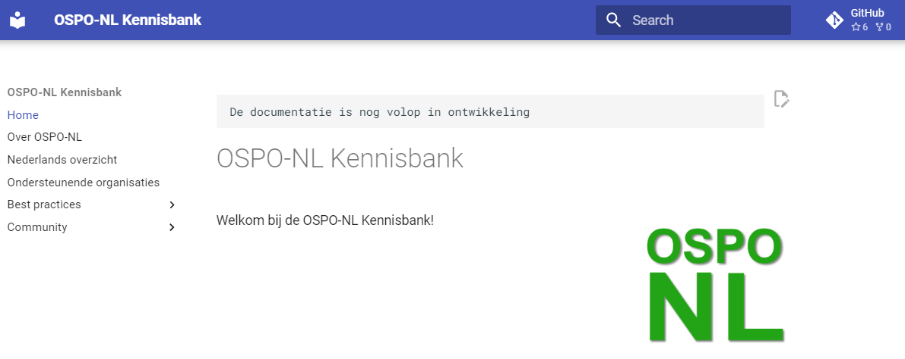

**❗De OSPO-NL-kennisbank wordt niet langer actief onderhouden. Kijk op https://www.opensourcewerken.nl
 voor de meest actuele informatie en verwijzingen naar andere relevante bronnen. Veel van de kennis uit
 deze kennisbank is inmiddels (ook) te vinden op
 [https://minvws.opensourcewerken.nl](https://minvws.opensourcewerken.nl).❗**

# OSPO-NL Kennisbank

De OSPO-NL kennisbank is een verzameling van kennis en best practices voor het opzetten en uitvoeren
van OSPO's (of OSPOs) bij organisaties in Nederland.

De OSPO-NL kennisbank is gepubliceerd op
[ospo-nl.github.io/kennisbank](https://ospo-nl.github.io/kennisbank/).



## Structuur

1. Home -> algemeen 'entry point' .. uitgebreid met een eerste leeswijzer
1. Best practices -> verzameling van best practices
1. Bronnen -> externe bronnen waar meer info is terug te vinden of overzichten
1. Community -> onze OSPO-NL community zaken
1. Nieuw project -> als je een nieuw project wilt starten, heb ik nodig ..

## Development

Voordat lokaal gebouwd kan worden, moeten alle dependencies geïnstalleerd worden. Dat is 'by
default' gebaseerd op [Python Poetry](https://python-poetry.org/docs/#installation) dependency &
package manager.

```bash
poetry install --no-interaction
```

Alternatief kan er gebruik gemaakt worden van de [Package Installer for
Python](https://pypi.org/project/pip/) (van je Operating System) en dan zijn de volgende packages
nodig:

- python3-poetry
- python3-poetry-core
- mkdocs
- mkdocs-material
- mkdocs-material-extensions

Lokaal kan vervolgens de documentatie site gebouwd en getest worden met (of `run.sh` :wink:):

```bash
poetry run mkdocs serve
```

De site kan dan lokaal benaderd worden op [http://localhost:8000](http://localhost:8000)

## Roadmap

Voor de [roadmap](https://github.com/orgs/ospo-nl/projects/1) gebruiken we GitHub Projects.

## Formaliteiten

Dit project is opgezet als een open source project. Iedereen is welkom om bijdragen te leveren. De
licentie is daarom ook vrij en geeft ook vrijheid om afgeleide werken te maken. Wij zijn inclusief
en maken geen onderscheid in etniciteit, sekse of andere persoonlijke voorkeuren; bijdragen worden
geacht zich daar aan te houden.

### Licentie 

Dit project is gelicentieerd onder de **[Creative Commons Attribution 4.0 International
License](https://github.com/ospo-nl/.github/blob/main/LICENSE)**.

### Bijdragen

Lees de **[Code of Conduct](https://ospo-nl.github.io/kennisbank/community/CODE_OF_CONDUCT/)**,
**[Contributing Guide](https://ospo-nl.github.io/kennisbank/community/CONTRIBUTING/)** en **[Project
Governance](https://ospo-nl.github.io/kennisbank/community/PROJECT_GOVERNANCE/)** voor de details
over hoe je kan bijdragen.


## Contact

Lees in de [SUPPORT](https://ospo-nl.github.io/kennisbank/community/SUPPORT/) over hoe je in contact
kunt komen met de OSPO-NL community.
