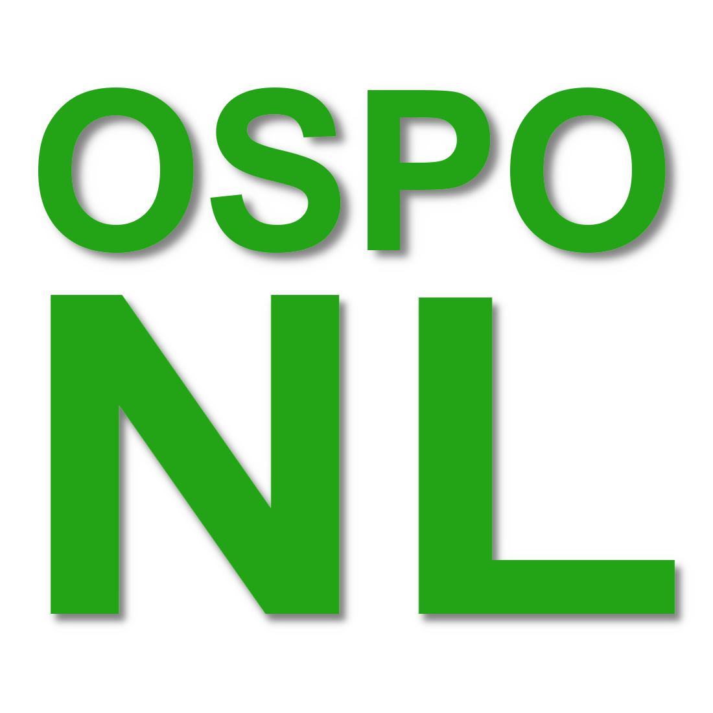

# Home

> De documentatie is nog volop in ontwikkeling. Via Pull Requests en Issues ontvangen we graag
> bijdragen. Zie daarvoor onze [Contributing Guide](./community/CONTRIBUTING.md).

Welkom bij de OSPO-NL Kennisbank!

De OSPO-NL kennisbank is een verzameling van kennis en best practices voor het opzetten en uitvoeren
van OSPO's bij organisaties in Nederland.

Deze kennisbank dient als startpunt met vooral veel referenties naar andere bronnen .. waarbij de
Nederlandse vertalingen hier verzameld kunnen worden als deze elders (nog) niet te vinden. Bijdragen
aan de (overwegend) Engelse bronnen mag natuurlijk ook :smile:

Kijk bijvoorbeeld eens:

- bij onze verzameling [best practices](./best-practices/)
- bij hoe begin ik een [nieuw project](./nieuw-project/)
- bij externe [bronnen](./bronnen/)

Uiteraard volgen wij onze eigen suggesties en zijn onze eigen 'voorzieningen' te vinden in
[Community](./community/).