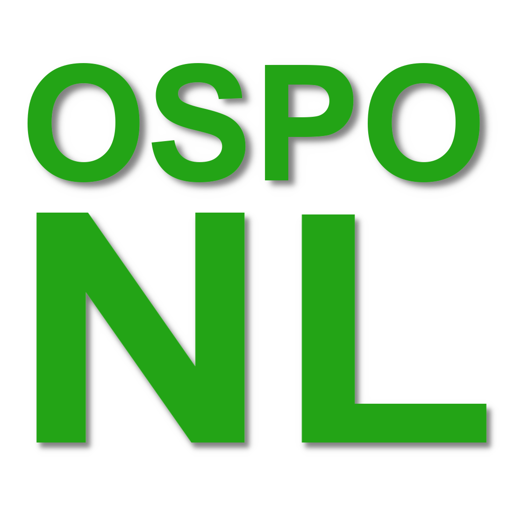

# Over OSPO-NL

OSPO staat voor Open Source Program Office. De toevoeging NL doelt op de Nederlandse samenwerking om
kennis en best practices te delen voor het opzetten en uitvoeren van OSPO's (of OSPOs) bij
organisaties in Nederland. Het is niet van belang of deze organisatie commerciële bedrijven zijn of
overheidsinstanties.

Het initiatief van deze community en samenwerking is ontstaan naar aanleiding van de
[OSPOlogy.live](https://community.linuxfoundation.org/events/details/lfhq-ospology-european-chapter-presents-ospologylive-share-learn-netherlands/)
van januari 2023. Dit event werd georganiseerd door de [Linux
Foundation](https://www.linuxfoundation.org/) en gehost door
[Alliander](https://www.alliander.com/en/open-source/projects/).

OSPO-NL is een open community welke gestart is door
[Alliander](https://www.alliander.com/en/open-source/projects/),
[Belastingdienst](https://github.com/belastingdienst) en [Kadaster](https://github.com/kadaster). We
verwelkomen graag meer deelnemers zodat kennis en uitvoering van OSPOs in organisaties in Nederland
gemakkelijker, sneller en beter wordt. En mogelijk meer gestandaardiseerd. Dat is geen doel op zich
... maar waarom een wiel meerdere keren opnieuw uitvinden :wink:

Veel inspiratie en inhoud kan al gevonden worden op de community waar we nauw mee verbonden zijn:
[TODO Group](https://todogroup.org/). We willen daar vooral ook samenwerking mee hebben en gebruik
maken van de resources die daar beschikbaar zijn. MAAR ... Nederlandse invulling, vertalingen en
specifieke samenwerkingen passen beter in een eigen 'NL chapter', een eigen Nederlands initiatief.
Vandaar [OSPO-NL](https://ospo-nl.github.io/kennisbank/) :rocket:

Voor meer informatie over onze [community](../) en werkwijze, check onze [CONTRIBUTING
GUIDE](./CONTRIBUTING.md) en [CODE OF CONDUCT](./CODE_OF_CONDUCT.md).
